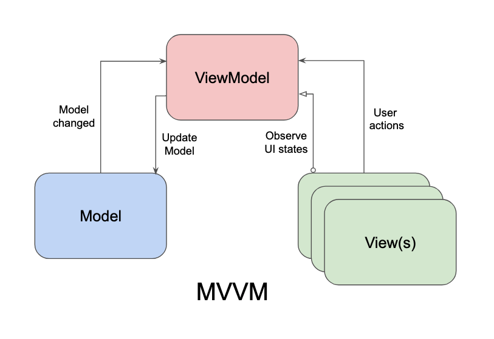

# React MVVM

React-MVVM is a project that demonstrates how to implement the Model-View-ViewModel (MVVM) architectural pattern in a React application. It aims to separate concerns, improve testability, and organize code by decoupling UI components from business logic and state management through the use of view models.

## Architecture

